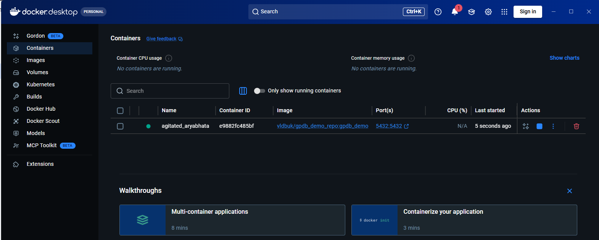
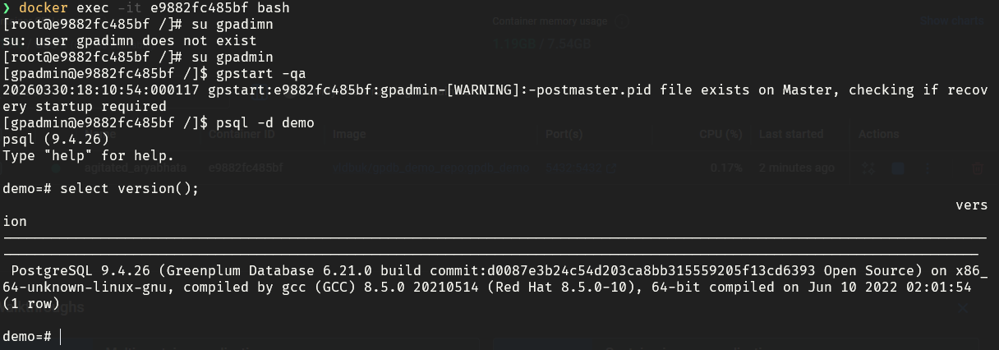
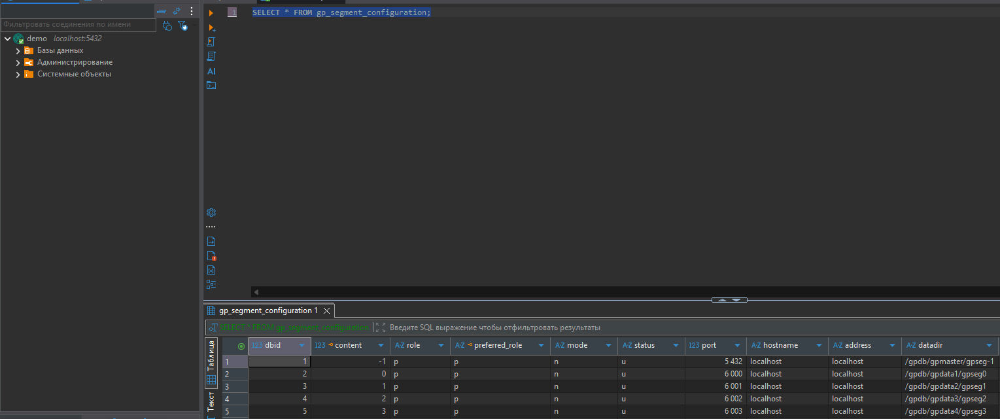

## Домашнее задание №1: Развёртывание и базовая конфигурация: Multi-node

1. Был скачен Docker Dekstop. Скачен и запущен необходимый image с Greenplum.
   
2. Произведено подключение через командную строку.
   
3. Также произведено подключение через DBeaver.
   
