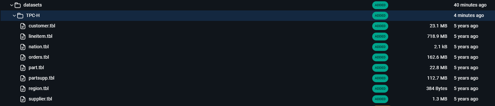
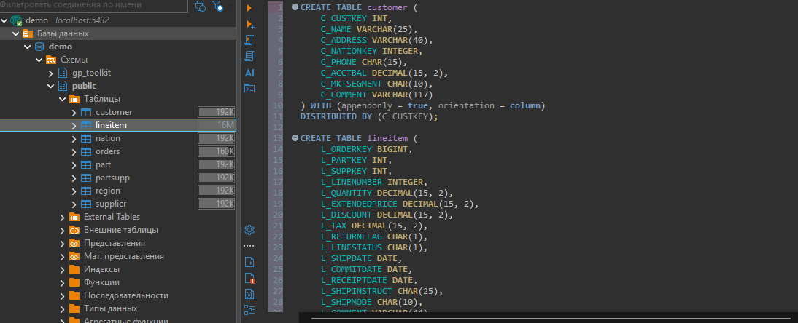
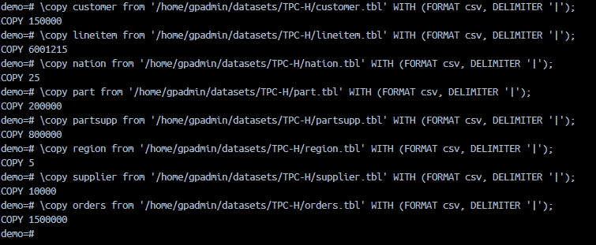

Задание:

## I часть:

### 1. Скачайте датасет (файл в формате .sql) из материалов занятия.

В материалах для занятия отсутсвуют данные для `Orders`, поэтому был скачен архив с другими даннами `TPC-H`

```bash
#!/bin/bash
curl -L -o ~/Downloads/tpch-1gb.zip\
  https://www.kaggle.com/api/v1/datasets/download/fven7u/tpch-1gb
```

Файлы закинуты в докер


### 2. Создайте таблицы по схемам DDL. Обращайте внимание на принципы секционирования.

Через DBeaver созданы модели (Файл DDL.sql)


### 3. Загрузите информацию в Greenplum командой COPY или другими способами (например, через external table).

Заполнены таблицы с использованием команды COPY

```bash
\copy customer from '/home/gpadmin/datasets/TPC-H/customer.tbl' WITH (FORMAT csv, DELIMITER '|');
\copy lineitem from '/home/gpadmin/datasets/TPC-H/lineitem.tbl' WITH (FORMAT csv, DELIMITER '|');
\copy nation from '/home/gpadmin/datasets/TPC-H/nation.tbl' WITH (FORMAT csv, DELIMITER '|');
\copy part from '/home/gpadmin/datasets/TPC-H/part.tbl' WITH (FORMAT csv, DELIMITER '|');
\copy partsupp from '/home/gpadmin/datasets/TPC-H/partsupp.tbl' WITH (FORMAT csv, DELIMITER '|');
\copy region from '/home/gpadmin/datasets/TPC-H/region.tbl' WITH (FORMAT csv, DELIMITER '|');
\copy supplier from '/home/gpadmin/datasets/TPC-H/supplier.tbl' WITH (FORMAT csv, DELIMITER '|');
\copy orders from '/home/gpadmin/datasets/TPC-H/orders.tbl' WITH (FORMAT csv, DELIMITER '|');
```



## II часть:

### 1. Составьте селект-запрос на соединение 3-4 таблиц из датасета. Замерьте время выполнения.

Сделан запрос на поиск информации по заказам конкретного клиента: статус заказа, стоимость заказа, дата заказа и время доставки, наименование каждой позиции в заказе.

```SQL
-- Файл Query.sql, П.1
SELECT c.c_custkey
     , c.c_name
     , o.o_orderkey
     , o.o_orderstatus
     , o.o_totalprice
     , o.o_orderdate
     , l.l_shipdate
     , p.p_name
  FROM customer AS c
  JOIN orders AS o
    ON o.o_custkey = c.c_custkey
  JOIN lineitem AS l
    ON l.l_orderkey  = o.o_orderkey
  JOIN part AS p
    ON p.p_partkey = l.l_partkey
 WHERE c.c_custkey = 143848;
```

Время выполнения составило:

```SQL
Planning time: 49.506 ms
Execution time: 3619.226 ms
```

Для `orders` и `lineitem` были отсканированы все партиции:

```SQL
Partitions selected: 87 (out of 87)
```

### 2. Настройте партиционирование таблиц по списку и периоду.

При созданиии моделей были определены партиции:

- для `lineitem`:

```SQL
PARTITION BY RANGE (L_SHIPDATE)
    (start('1992-01-01') INCLUSIVE end ('1998-12-31') INCLUSIVE every (30), default partition others);
```

- для `orders`:

```SQL
PARTITION BY RANGE (O_ORDERDATE)
    (start('1992-01-01') INCLUSIVE end ('1998-12-31') INCLUSIVE every (30), default partition others);
```

### 3. Составьте селект-запрос на соединение 3-4 таблиц из датасета с применением фильтров по партициям. Замерьте время выполнения и сравните его с результатом из первого пункта.

Был выполнен аналогичный запрос из п.1, но с дополнительными фильтрами по датам:

- хотим отобрать заказы только за январь 1994 года
- дата доставки в первой половине года. Ожидается, что все доставки будут исполняться быстрее, чем определена правая граница

```SQL
-- Файл Query.sql, П.2
SELECT c.c_custkey
     , c.c_name
     , o.o_orderkey
     , o.o_orderstatus
     , o.o_totalprice
     , o.o_orderdate
     , l.l_linenumber
     , l.l_shipdate
     , p.p_name
  FROM customer AS c
  JOIN orders AS o
    ON o.o_custkey = c.c_custkey
   AND o.o_orderdate BETWEEN '1994-01-01'::DATE AND '1994-01-31'::DATE
  JOIN lineitem AS l
    ON l.l_orderkey  = o.o_orderkey
   AND l.l_shipdate BETWEEN '1994-01-01'::DATE AND '1994-06-30'::DATE
  JOIN part AS p
    ON p.p_partkey = l.l_partkey
 WHERE c.c_custkey  = 143848;
```

Время выполнения сократилось в разы:

```SQL
Planning time: 59.362 ms
Execution time: 217.046 ms
```

Для `orders` было отсканировано 3 партиции из 87:

```SQL
->  Partition Selector for orders (dynamic scan id: 1)  (cost=10.00..100.00 rows=25 width=4) (never executed)
        Partitions selected: 3 (out of 87)
```

Для `orders` было отсканировано 8 партиции из 87:

```SQL
->  Partition Selector for lineitem (dynamic scan id: 2)  (cost=10.00..100.00 rows=25 width=4) (never executed)
        Partitions selected: 8 (out of 87)
```

За счёт дополнительного фильтра по датам время выполнения сократилось более чем в 15 раз!
