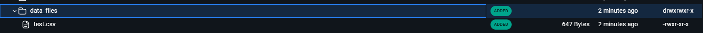
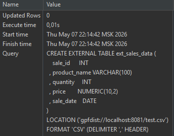
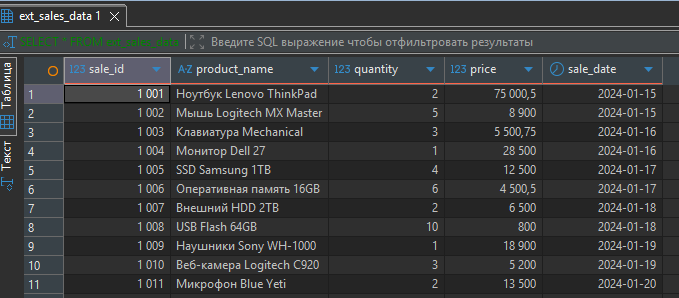

# Работа с внешними таблицами

1. Был сгенерирован небольшой CSV (файл test.csv)
2. Закинут в докер контейнер:

3. Создана внешняя таблица с нужной структурой под CSV:

```sql
CREATE EXTERNAL TABLE ext_sales_data (
    sale_id      INT
  , product_name VARCHAR(100)
  , quantity     INT
  , price        NUMERIC(10,2)
  , sale_date    DATE
)
LOCATION ('gpfdist://localhost:8081/test.csv')
FORMAT 'CSV' (DELIMITER ',' HEADER);
```


4. Данные успешно считаны:
```sql
SELECT * FROM ext_sales_data;
```
