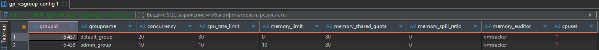
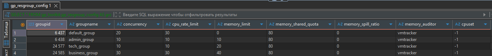
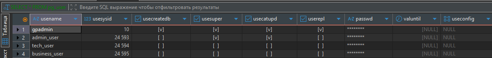
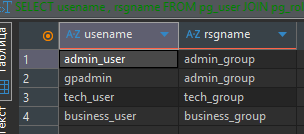
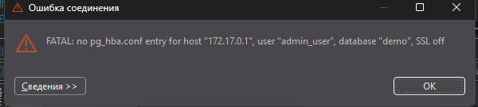
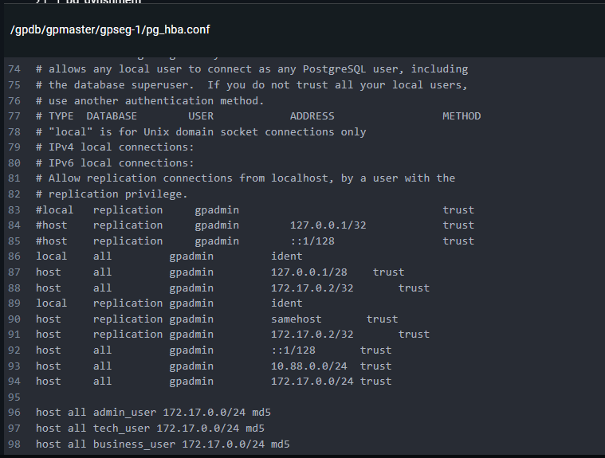
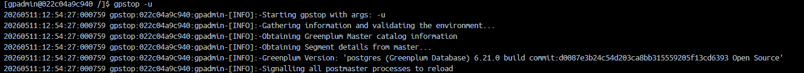
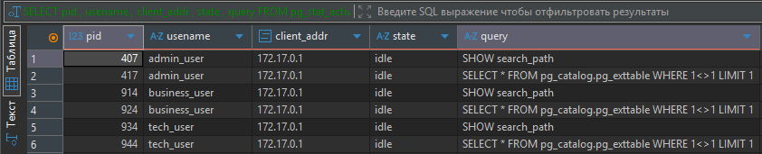
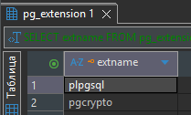

### Описание/Пошаговая инструкция выполнения домашнего задания:

#### 1. Настроить ресурсные группы пользователей (администраторы, технические пользователи, бизнес-пользователи)
1. Изначально имеются 2 ресурсные группы `default` и `admin`
```sql
SELECT * FROM gp_toolkit.gp_resgroup_config AS grc;
```


2. Создадим еще 2 группы `tech` и `business`:
```sql
-- Группа для технических задач
CREATE RESOURCE GROUP tech_group WITH (
    CONCURRENCY=10
  , CPU_RATE_LIMIT=10
  , MEMORY_LIMIT=20
  , MEMORY_SHARED_QUOTA=80
  , MEMORY_SPILL_RATIO=0
);

-- Группа для бизнес-пользователей
CREATE RESOURCE GROUP business_group WITH (
    CONCURRENCY=30
  , CPU_RATE_LIMIT=30
  , MEMORY_LIMIT=40
  , MEMORY_SHARED_QUOTA=80
  , MEMORY_SPILL_RATIO=0
); 
```


#### 2. Создать пользователей на каждую группу. Определить метод аутентификации.
1. Изначально имеется только `user` стандартный `gpadmin`:
```sql
SELECT * FROM pg_user;
```


2. Создадим 3-х пользователей `admin`, `tech` и `business`:
```sql
-- Админ
CREATE ROLE admin_user WITH
    LOGIN
    ENCRYPTED PASSWORD 'AdminPass123!'
    SUPERUSER
    RESOURCE GROUP admin_group;
-- Технический-пользователь
CREATE ROLE tech_user WITH
    LOGIN
    ENCRYPTED PASSWORD 'TechPass456!'
    RESOURCE GROUP tech_group;
-- Бизнес-пользователь
CREATE ROLE business_user WITH
    LOGIN
    ENCRYPTED PASSWORD 'BusinessPass789!'
    RESOURCE GROUP business_group;
```

3. Имеем пользователей:

4. Распределение по ресурсным группам:
```sql
SELECT pu.usename 
     , rg.rsgname
  FROM pg_user AS pu
  JOIN pg_roles AS pr
    ON pu.usename = pr.rolname
  JOIN pg_resgroup AS rg
    ON pr.rolresgroup= rg.oid
```
+

#### 3. На отдельной от Greenplum машине проверить доступ до БД через DBeaver/psql. Настроить политики доступа посредством конфигурационных файлов.
1. При попытке подключить по логину и паролю возникает ошибка:

2. На мастере в файле `pg_hba.conf` для всех пользователей прокинут доступ, т.к делается внутри `Docker`, все подключения идут с локальной адреса:

3. Для того, чтобы изменения вступили в силу, перезагружаю кластер:

4. Подключение прошло успешно:
```sql
SELECT pid
     , usename
     , client_addr
     , state
     , query
  FROM pg_stat_activity
 WHERE usename IN ('admin_user', 'tech_user', 'business_user');
```


### Дополнительные задачи по желанию:
#### 4. Настроить шифрование диска с помощью pgcrypt
1. Установим расширение `pgcrypto`
```sql
 CREATE EXTENSION pgcrypto;
 SELECT extname FROM pg_extension;
```


2. Создадим таблицу, вставим 2 записи, одну с использованием шифрование, другую без.
```sql
 CREATE TABLE crypto_test (
     id    BIGINT
   , value VARCHAR
 );
 
 INSERT 
   INTO crypto_test
 VALUES (1, pgp_sym_encrypt('test1', 'key'))
      , (1, 'test1');

SELECT * FROM crypto_test;
```
3. В результате таблица имеет зашифрованную запись и обычную.


P.S Пункты: «Настроить отдельный сервер LDAP и связку с БД» и «Настроить SSL-соединение» оказались непосильными =)