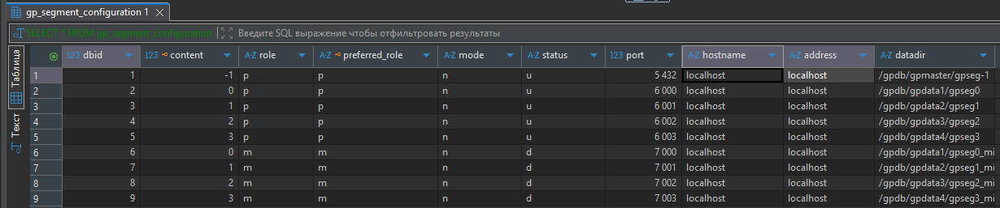
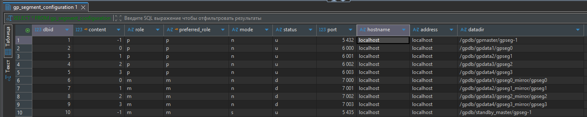
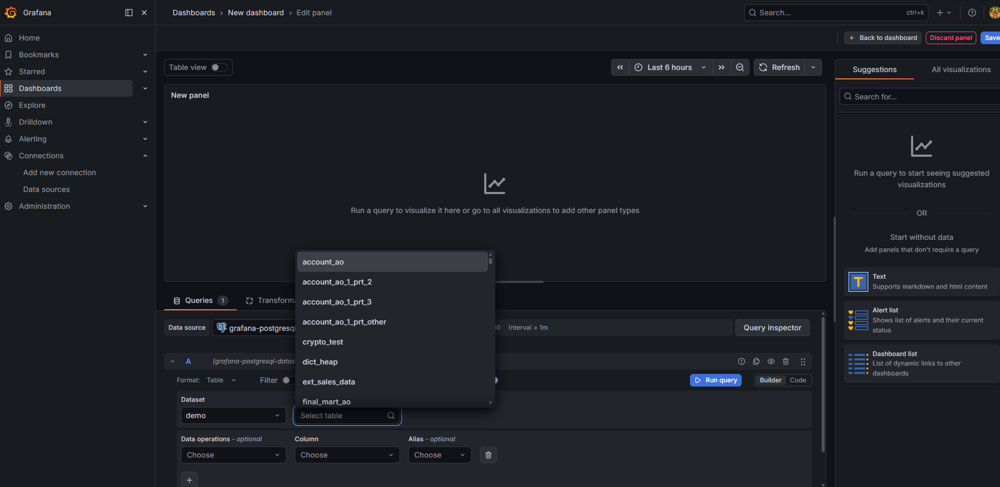
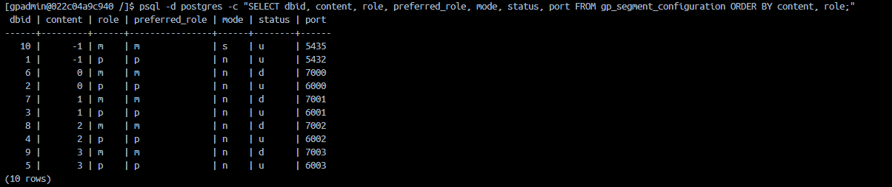
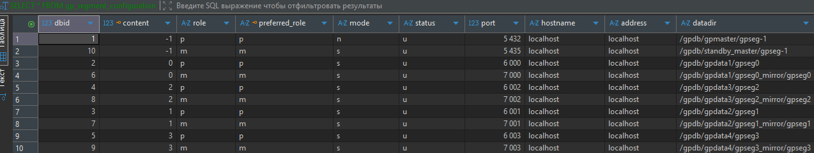
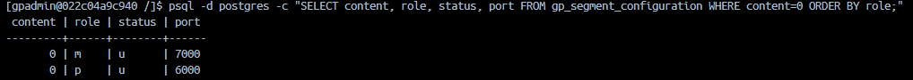
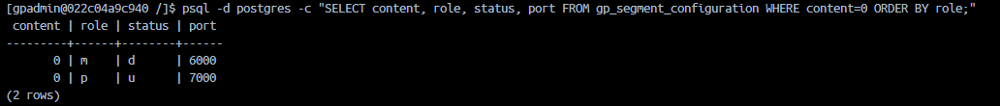
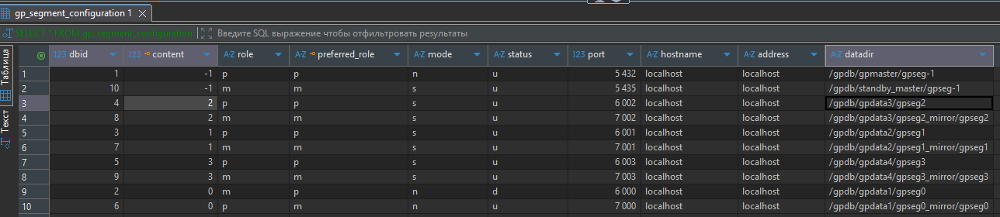
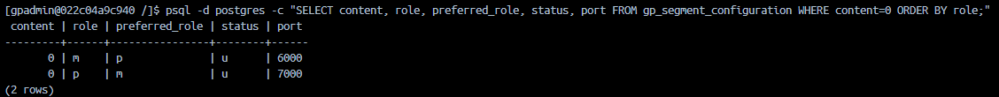
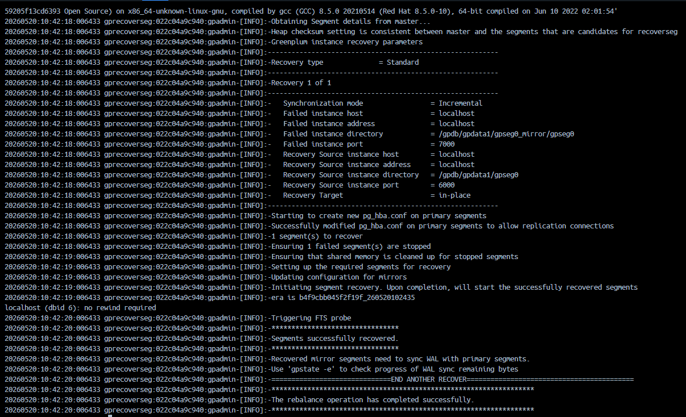

### I часть:

#### 1. На уже развернутом кластере Greenplum произведите зеркалирование данных как для вычислительных нод, так и для мастер-ноды.
Изначально запущенный догер не имел зеркал.
Созданы папки для зеркал
```bash
mkdir -p /gpdb/gpdata1/gpseg0_mirror
mkdir -p /gpdb/gpdata2/gpseg1_mirror
mkdir -p /gpdb/gpdata3/gpseg2_mirror
mkdir -p /gpdb/gpdata4/gpseg3_mirror
```
Далее созданы зеркала
```bash
gpaddmirrors -p 1000
```

Далее создал папку для мастер
```bash
mkdir -p /gpdb/standby_master
```
Выдал права
```bash
chmod 644 /gpdb/gpmaster/gpseg-1/pg_hba.conf
```
Запустил создание зеркала для мастера
```bash
gpinitstandby -s localhost -P 5435 -S /gpdb/standby_master/gpseg-1
```
#### 2. Проверьте статус репликации через системные утилиты.
Теперь зеркала есть у всех

#### 3. Разверните и настройте подключение Grafana и Greenplum через Prometheus.
Добавлены файлы для поднятия докера:
- prometheus.yml
- docker-compose.yaml
Создана общая сеть
```bash
docker network create monitoring
```
Подключен GP к сети
```bash
docker network connect monitoring focused_shirley
```
Был поднят контейнер с Grafana и Prometheus и подключен доступ к GP 

### II часть:

#### 1. Произведите симуляцию падения сегментной ноды.
Сначала имеем все сегменты в рабочем состоянии

Увидел, что зеркала «лежат». Сначала поднимем их.
Выдал права, до этого не поднялись из-за отсутствия прав
```bash
chown -R gpadmin:gpadmin /gpdb/gpdata1/gpseg0_mirror
chown -R gpadmin:gpadmin /gpdb/gpdata2/gpseg1_mirror
chown -R gpadmin:gpadmin /gpdb/gpdata3/gpseg2_mirror
chown -R gpadmin:gpadmin /gpdb/gpdata4/gpseg3_mirror
```
Поднимаю зеркала
```bash
gprecoverseg -a -F
```
Теперь все в порядке

Смоделируем падение сегмента «0»

```bash
kill -9 $(ps aux | grep 6000 | grep postgres | grep -v grep | awk '{print $2}')
```
#### 2. Убедитесь, что БД не упала, и mirror-сегменты включены.

Через какое-то время 7000 порт стал работать вместо 6000
БД не упала, запросы выполняются


#### 3. Устраните проблему, поднимите primary-сегменты и произведите ребалансировку данных.
Запустил для поднятия сегмента
```bash
gprecoverseg -F
```
Сегмент снова работает yf 6000 порту

Запустил ребалансировку
```bash
gprecoverseg -r
```
